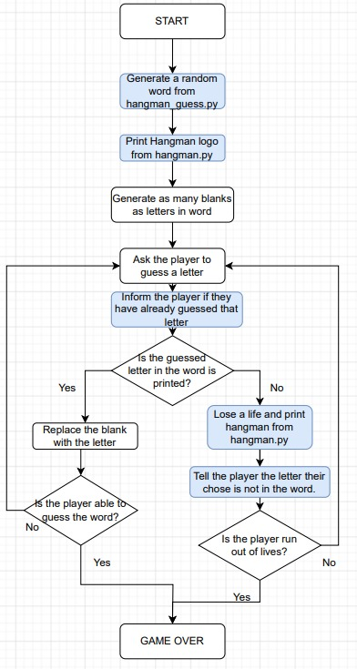

<h1 align="center">Hangman Game: Game of guess</h1>

## What is Hangman game?
Hangman is a word-guessing game that is often played between two people. One person thinks of a word and draws a blank line for each letter in the word. The other person tries to guess the word by suggesting letters. For each incorrect guess, a part of a stick figure (representing a "hangman") is drawn. The goal is to guess the word before the hangman is fully drawn.

### Setup

- The computer randomly picks a word from a guessed_word.
- Determine the maximum number of guesses (life) allowed. You have a chance of 6 lifes

### Displaying the Word

Display spaces "(_)" to represent each letter in the chosen word.

#### Guessing Letters

- The game continues with the guess...

  ## How hangman game works
  

#### Incorrect Guesses

- If the player makes incorrect guess and it is not present in the spaces revealed "(\_)" . The player loses a life.
- It also keep track of a alphabet that is alraedy guessed "You have already guessed a letter"
- Keep track of a guess counter.

#### Victory Condition

- If all letters are correctly guessed before reaching or exceeding the number of life. You win!

#### Defeat Condition

- If the player reaches the number of guesses before guessing the word or already guessed the leter. It will print "You have alraedy guessed a letter, You lose"

  - #### Returning Visitor Goals

#### Starting a New Round

- Initiate a round where the computer chooses an unrevealed word.

  #### Return player

  - When a Hangman player comes back for another game they can expect a mix of familiarity and variety. Here's what they might encounter

#### A Range of Words

- The word keeper, the computer selects words each time leading to challenges.

#### Increasing Challenge

- As players gain experience they may come across words that are more complex and longer in length.

#### Developing Strategies

- Experienced players often develop their strategies to improve their chances of guessing the word. For example starting with vowels or common consonants can be helpful.

- #### Personal Preferences
- Players may develop preferences for word categories or themes. This can influence how much they enjoy the game.

- #### Sharpened Deduction Skills
- Returning players tend to enhance their deduction skills over time. They become better at making educated guesses based on patterns and the revealed letters.

- #### Multiplayer Experience
- In multiplayer settings players who come back to the game can enjoy the aspect of playing with friends or family competing against each other.

## Features

### Frameworks, Libraries & Programs Used

1. [Hangman logo:](https://ascii.co.uk/art/hangman)
   - At the start of the guessing game, hangman logo appear
2. [guess_word](https://opeanai/)
   - The guess_word list was generated by openai.
3. [GitHub](https://github.com/)
   - GitHub is used to store the projects code after being pushed from Git.
4. [Heroku](https://dashboard.heroku.com/apps)
-    This tools was use to deploy and run my program hangman.

### Testing

- Pass the code through a PEP8 linter and confirmed: All clear, no errors found
- I test on my local terminal.
- I had to reboot my project due to deployment errors, opting to begin anew with a different template. Unfortunately, I lost over 40 commit messages from my previous template. 

- Previous template: https://github.com/SamAkinbile/Hangman

  ### Validator Testing

- PEP8
- No errors were returned from [testing](https://pep8ci.herokuapp.com/#)

## Deployment

### GitHub Pages

The project was deployed to GitHub Pages using the following steps...

1. Log in to GitHub and locate the [GitHub Repository](https://github.com/)
2. At the top of the Repository (not top of page), locate the "Settings" Button on the menu.
   - Alternatively Click [Here](https://raw.githubusercontent.com/) for a GIF demonstrating the process starting from Step 2.
3. Scroll down the Settings page until you locate the "GitHub Pages" Section.
4. Under "Source", click the dropdown called "None" and select "Master Branch".
5. The page will automatically refresh.
6. Scroll back down through the page to locate the now published site [link](https://github.com) in the "GitHub Pages" section.

### Heroku Pages

The project was deployes to GitHub pages using the following steps...

1.  Sign up for a Heroku account at https://signup.heroku.com/.
2.  Download and install the Heroku Command Line Interface (CLI) from https://devcenter.heroku.com/articles/heroku-cli.
3. Use `heroku login` in the terminal to log in to your Heroku account.
4. Run `heroku create your-app-name` to create a new Heroku app.
5. Create a `Procfile` specifying how to run your app, commit changes, and push to Heroku with `git push heroku master`.
6. Open your app with `heroku open` and scale the web process if needed with `heroku ps:scale web=1`.

The live link can be found here - https://newhangman-0cce8688612c.herokuapp.com/

## Credits

### Media

- Hangman logo [ascii ](https://ascii.co.uk)
- Guess word list [chatgpt](https://openai.com/)

### Acknowledgements
 
- Tutor support and student care at Code Institute for their support.
